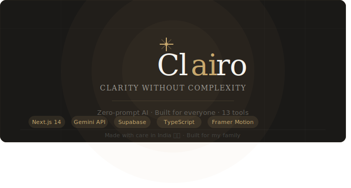

  # Clairo

> **Clarity without complexity.**

<p align="center">
  
</p>

---

## Why I Built This

I didn't build Clairo because AI is trending.

I built it because I watched my parents struggle.

My dad spent an entire evening trying to copy a formal business document word by word and re-write the document's scanned pdf into an editable word document. My grand mother received a medical report and had no idea what her blood sugar and haemoglobin numbers meant — she was anxious for two days before her next doctor's appointment.

Both of these problems could have been solved in under 60 seconds with AI.

But they couldn't use AI. Not because they aren't smart — they're incredibly capable people. But because every AI tool starts with a blank box that says "Type a prompt." And if you've never heard the word "prompt," that blank box is a wall.

Clairo removes that wall entirely.

---

## The Problem I'm Solving

The people who need AI the most are the ones least able to use it.

Farmers trying to find government schemes they qualify for. Parents trying to understand a medical report. Small shop owners who want to post a festival offer on WhatsApp but don't know how to phrase it. First-generation students writing their first professional email.

These aren't niche problems. In India alone, hundreds of millions of people do these tasks manually every day — spending hours on something that should take minutes — simply because the tools that could help them were never designed with them in mind.

Clairo is designed exclusively for them.

No prompts. No jargon. No learning curve.
Just: tell us what you need, answer a few simple questions, and we'll handle the rest.

---

## Built For

- Parents and elderly users
- First-time AI users
- Small business owners
- Students
- Non-English speakers
- Anyone who has ever felt excluded by technology

---

## Live Demo

<!-- Add your deployed URL here before submitting -->
**[Live Demo](#)** — _coming soon_

## Demo Video

<!-- Add a Loom/YouTube link or embed here -->
**[Watch the demo](#)** — _coming soon_

---

## What Makes Clairo Different

Most AI tools are built for people who already understand AI. They assume you know what a "prompt" is. They give you a blank text box and expect you to know how to fill it.

Clairo assumes nothing.

Every tool is a guided conversation — one simple question at a time. If you're not sure what to enter, there's a "Help me decide" option. If you'd rather speak than type, there's a voice input. If your parents are using it, there's a Family Mode with larger text, bigger buttons, and even simpler flows.

The entire product is built around one question I asked myself before every design decision:

"Would someone's parent understand this immediately?"

If the answer was no — I simplified it further.

---

## Features

### 13 Purpose-Built AI Tools

| Tool | Description |
|------|-------------|
| **Document Wizard** | Write letters, applications, affidavits, rent agreements, legal complaints, and 14 other document types |
| **Email Assistant** | Reply to emails or write new ones with guided tone/length controls |
| **Receipt Scanner** | Scan receipts and extract totals, items, and dates |
| **Form Filler** | Upload a form image and get help filling it out |
| **Schedule Maker** | Create daily/weekly schedules or exam study planners with revision days |
| **Business Helper** | Generate invoices, Instagram captions, review replies, and business reports |
| **Learn Anything** | Explain any topic, document, or URL in simple terms |
| **Doc Transcriber** | Convert handwritten or printed documents to editable text |
| **Government Schemes** | Find government schemes and subsidies you qualify for |
| **Medical Simplifier** | Understand blood tests, prescriptions, and medical reports in plain language |
| **Resume Assistant** | Build resumes, write cover letters, and practice for interviews with AI feedback |
| **WhatsApp Assistant** | Draft messages, create template libraries, and bulk-reply to customers |
| **Scam Detector** | Check if a message, call, or link might be a scam |

### Platform Features

- **Voice Input** — Speak instead of type, in English, Hindi, or Hinglish
- **Ask Clairo Anything** — Universal chat fallback for anything that doesn't fit a specific tool
- **One-Question-at-a-Time Wizard** — No overwhelming forms, just guided conversations
- **"Help Me Decide"** — Contextual suggestions when users aren't sure what to pick
- **Action Chips** — One-tap refinements (make shorter, more formal, translate to Hindi) without re-typing
- **Trust Indicators** — Human-friendly confidence levels on every output
- **6 AI Personas** — Office Assistant, Friendly Teacher, Legal Helper, Government Expert, Business Consultant, Patient Explainer
- **Family Mode** — Larger text, bigger buttons, simplified flows for elderly users
- **Dark Mode** — Full dark theme with a premium calm aesthetic
- **11 Indian Languages** — English, Hindi, Hinglish, Tamil, Telugu, Bengali, Marathi, Kannada, Malayalam, Gujarati, Punjabi
- **Download Outputs** — Export as .docx, .pdf, or .txt
- **History** — Searchable, filterable log of everything you've created

---

## The Story Behind the Design

Most AI tools are built for people who already understand AI. They assume you know what a "prompt" is. They give you a blank text box and expect you to know how to fill it.

Clairo assumes nothing.

Every tool is a guided conversation — one simple question at a time. If you're not sure what to enter, there's a "Help me decide" option. If you'd rather speak than type, there's a voice input. If your parents are using it, there's a Family Mode with larger text, bigger buttons, and even simpler flows.

The entire product is built around one question I asked myself before every design decision:

"Would someone's parent understand this immediately?"

If the answer was no — I simplified it further.

---

## Tech Stack

| Layer | Technology |
|-------|-----------|
| **Framework** | Next.js 14 (App Router) |
| **Language** | TypeScript (strict mode) |
| **Styling** | Tailwind CSS + CSS Variables design system |
| **Animations** | Framer Motion |
| **AI** | Google Gemini API (gemini-1.5-flash + gemini-1.5-pro) |
| **Voice** | Web Speech API |
| **Database** | Supabase (PostgreSQL, Auth, Storage) |
| **Auth** | Google OAuth, Magic Link, Guest Mode |
| **Deployment** | Vercel |

### Architecture Decisions

- **Server-side AI only** — All Gemini API calls go through `/api/` routes. The API key is never exposed to the client.
- **Streaming responses** — Every AI tool streams output via `ReadableStream` for instant feedback.
- **Prompt isolation** — All system prompts live in `lib/prompts/`, never in components. Easy to tune without touching UI.
- **CSS Variables design system** — All colors, radii, and shadows are semantic tokens. Dark mode is a single class toggle.
- **Voice intent routing** — Voice inputs are classified by confidence level: high confidence routes directly to the right tool, medium/low opens the universal chat for clarification.

---

## What I Learned Building This

This was my first full-stack AI application.

I learned Next.js 14 App Router, TypeScript, Supabase, and the Gemini API while building it — not before. Most of the technical problems I encountered, I had never seen before. I solved them one by one.

But the harder lessons weren't technical.

I learned that designing for non-technical users is significantly harder than designing for developers. Every label, every button, every error message had to be rethought from scratch. "Invalid input" means nothing to my mom. "Please check what you entered" does.

I learned that the best AI products aren't the ones with the most features — they're the ones where the AI is most invisible. Where the user just... gets what they needed, without knowing or caring how.

I learned that the most meaningful things to build are the ones that solve problems you've personally witnessed. Not problems you read about in a product brief.

Clairo started as a portfolio project.
It became something I genuinely want my parents to use every day.

---

## Getting Started

### Prerequisites

- Node.js 18+
- A Google Gemini API key
- A Supabase project (optional — guest mode works with localStorage)

### Installation

```bash
# Clone the repository
git clone https://github.com/Sohangi-Singh/Clairo--Clarity-without-complexity.git
cd Clairo--Clarity-without-complexity/clairo

# Install dependencies
npm install

# Set up environment variables
cp .env.example .env.local
```

Add your keys to `.env.local`:

```env
GEMINI_API_KEY=your_gemini_api_key
NEXT_PUBLIC_SUPABASE_URL=your_supabase_url
NEXT_PUBLIC_SUPABASE_ANON_KEY=your_supabase_anon_key
SUPABASE_SERVICE_ROLE_KEY=your_supabase_service_role_key
```

```bash
# Start the development server
npm run dev
```

Open [http://localhost:3000](http://localhost:3000) to see Clairo.

---

## Project Structure

```
clairo/
├── app/
│   ├── page.tsx                 # Landing page
│   ├── dashboard/               # Main dashboard
│   ├── chat/                    # "Ask Clairo Anything" universal chat
│   ├── tools/                   # All 13 tool pages
│   │   ├── document-wizard/
│   │   ├── email-helper/
│   │   ├── receipt-scanner/
│   │   ├── medical-simplifier/
│   │   └── ... (10 more)
│   ├── api/
│   │   ├── ai/                  # 13 AI route handlers + chat + fetch-url
│   │   └── voice/intent/        # Voice intent classification
│   ├── auth/                    # Login / signup
│   ├── onboarding/              # 3-step onboarding flow
│   ├── history/                 # Usage history
│   └── settings/                # User preferences
├── components/
│   ├── ui/                      # Design system (Button, Card, Toggle, etc.)
│   ├── layout/                  # Sidebar, TopBar, MobileNav, ToolLayout
│   ├── wizard/                  # WizardShell, StepNav, HelpMeDecide
│   ├── voice/                   # VoiceInput
│   ├── upload/                  # DropZone, FilePreview
│   ├── output/                  # OutputCard, ActionChips, TrustIndicator
│   ├── persona/                 # PersonaPicker
│   └── dashboard/               # ToolGrid, WelcomeBanner, RecentActivity
├── hooks/                       # useAI, useVoice, useUpload, useFamilyMode, useHistory
├── lib/
│   ├── gemini.ts                # Gemini client (flash + pro models)
│   ├── prompts/                 # All 14+ system prompts (isolated from UI)
│   └── supabase/                # Client + server Supabase clients
├── types/                       # TypeScript types, tool definitions, personas
└── public/                      # Static assets
```

---

## Roadmap

- [ ] **Multi-language AI responses** — Full output generation in Hindi, Tamil, Telugu, and 8 more Indian languages (not just translation, but native generation)
- [ ] **Offline mode** — Cache recent tools and outputs so users with unreliable internet can still access their history and templates
- [ ] **WhatsApp integration** — Send generated messages directly to WhatsApp via deep links, and eventually a WhatsApp Business API chatbot
- [ ] **Community templates** — A shared library where users can publish and discover document templates, email formats, and business content that worked for them

---

## A Note to Anyone Reading This

If you're a recruiter, reviewer, or fellow developer:

Clairo isn't finished. It will never be "finished" — because the people it's built for will always have new problems that deserve better tools.

But what it represents is complete:
A belief that AI should work for everyone.
Not just for people who know how to use it.

If that belief resonates with you, I'd love to talk.

— Sohangi Singh
  E-Mail- sohangisingh@gmail.com
  [LinkedIn](https://www.linkedin.com/in/sohangi-singh-b43232373/)

---

## License
All rights are reserved.
